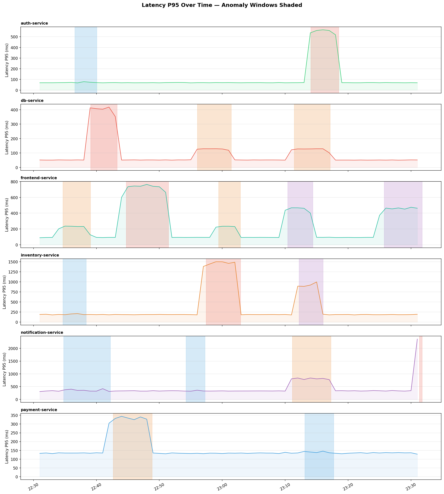
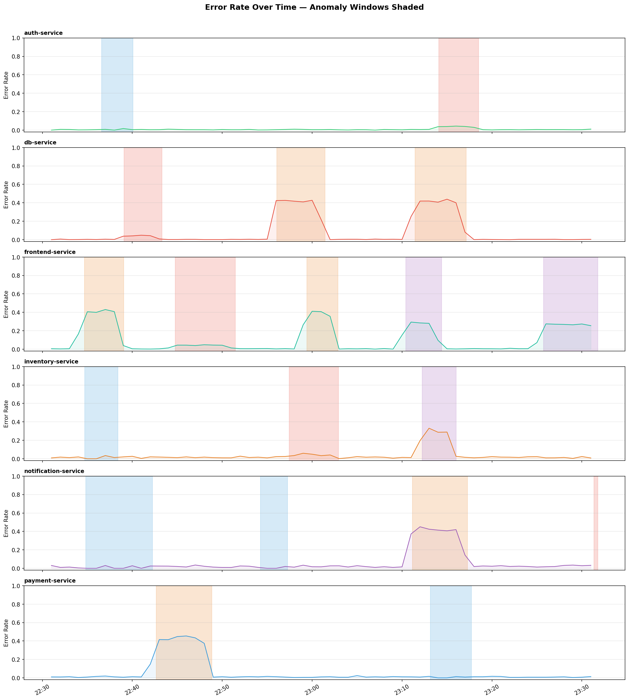
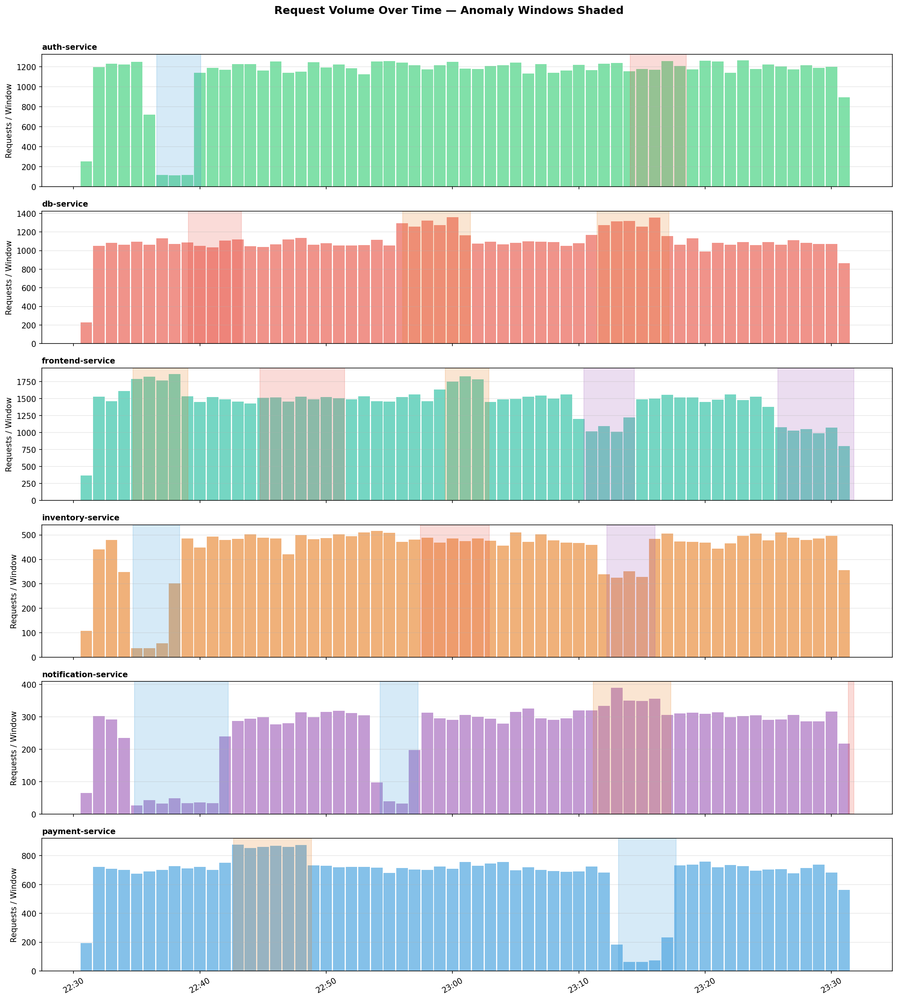

<p align="center">
  
  
  
  
  
</p>

# Real-Time Log Anomaly Detection & Root Cause Analysis Platform

A production-style AIOps pipeline that detects anomalous behaviour in distributed microservices and infers the probable root cause — using nothing but log data.

## What this project does

```
Simulated Services  →  Log Normalizer  →  Feature Extractor  →  Anomaly Detector  →  Root Cause Analysis
    (6 services)         (validation)       (60s windows)       (Isolation Forest)      (dependency graph)
```

1. **Generates** realistic microservice logs with configurable anomaly injection (latency spikes, error storms, traffic drops, mixed degradation)
2. **Normalises** raw events into a typed, validated schema (OpenTelemetry-aligned)
3. **Extracts** time-windowed features: latency percentiles, error rates, request volumes, event type distributions
4. **Detects** anomalies using an Isolation Forest trained on normal-only windows
5. **Infers root causes** by walking the service dependency graph to find the deepest anomalous upstream service
6. **Exposes** results through a FastAPI REST API and a Streamlit dashboard

---

## Architecture

```
┌──────────────┐     ┌──────────────┐     ┌──────────────────┐     ┌──────────────┐     ┌───────────────┐
│  Log         │     │  Normalizer  │     │  Feature         │     │  Anomaly     │     │  Root Cause   │
│  Generator   │────▶│  (Pydantic)  │────▶│  Extractor       │────▶│  Detector    │────▶│  Analysis     │
│              │     │              │     │  (60s windows)   │     │  (IsoForest) │     │  (Dep Graph)  │
└──────────────┘     └──────────────┘     └──────────────────┘     └──────────────┘     └───────────────┘
      │                                                                                        │
      ▼                                                                                        ▼
   data/raw/                                                                              data/results/
   (JSON)                                                                            anomalies.json
                                                                                     alerts.json
                                                                                     metrics.json
```

### Service Dependency Graph

```
frontend-service
├── auth-service
├── payment-service → db-service
└── inventory-service → db-service

notification-service (standalone)
db-service (leaf node, shared dependency)
```

---

## Pipeline Results

```
Events generated:    306,360
Feature windows:     366
Anomalies detected:  130
Alerts generated:    12
Precision:           0.800
Recall:              0.972
F1 Score:            0.878
```

The Isolation Forest achieves **97% recall** (catches nearly all real anomalies) with **80% precision** (low false positive rate).

---

## Phase 1: Data Simulation & Exploration

### Generated Data

- **306,000+** log events across 6 services over 60 minutes
- **19 anomaly windows** injected with 4 distinct failure modes
- Each event carries **20 fields** including `trace_id`, `span_id`, `host_id`, `severity_number` (OpenTelemetry-aligned)

### Visual Validation

Anomaly windows are shaded on each chart. Spikes/drops must visually align with the shaded regions — if they don't, the generator needs fixing.

**Latency P95 by Service:**



**Error Rate by Service:**



**Request Volume by Service:**



---

## JSON Schema (Locked)

Every downstream component depends on this shape. The schema is considered **locked** as of Phase 1.

```json
{
  "trace_id":             "string  — 24-char hex, links spans across services",
  "span_id":              "string  — unique per hop within a trace",
  "timestamp_iso":        "string  — ISO 8601 with timezone",
  "timestamp_unix":       "float   — seconds since epoch, 3 decimal places",
  "service_name":         "string  — e.g. frontend-service",
  "host_id":              "string  — e.g. frontend-service-pod-2",
  "environment":          "string  — production (V1 constant)",
  "endpoint":             "string  — e.g. /home, /auth/login",
  "method":               "string  — GET | POST | PUT | DELETE",
  "log_level":            "string  — DEBUG | INFO | WARN | ERROR | FATAL",
  "severity_number":      "int     — OTel-aligned: DEBUG=5, INFO=9, WARN=13, ERROR=17, FATAL=21",
  "status_code":          "int     — HTTP status code (200, 500, etc.)",
  "latency_ms":           "float   — response latency in milliseconds",
  "request_id":           "string  — unique per request",
  "dependency":           "string? — downstream service called, or null",
  "event_type":           "string  — semantic label (request_ok, slow_response, db_refused, ...)",
  "message":              "string  — human-readable log message",
  "is_synthetic_anomaly": "bool    — true if event was generated during an anomaly window",
  "anomaly_type":         "string? — latency_spike | error_storm | traffic_drop | mixed | null"
}
```

---

## Anomaly Types

| Type | Effect | Key Indicators |
|------|--------|---------------|
| `latency_spike` | 8x latency multiplier | P95 latency jumps, `slow_response` events |
| `error_storm` | 45% error rate, 1.2x RPS | 5xx spike, `upstream_failure` / `db_refused` events |
| `traffic_drop` | 0.1x RPS, 1.1x latency | Request volume collapses, `traffic_drop` events |
| `mixed` | 5x latency, 30% errors, 0.7x RPS | Combined degradation pattern |

---

## Quick Start

```bash
# Clone
git clone https://github.com/<your-username>/Multi-Service-Log-Anomaly-Detection.git
cd Multi-Service-Log-Anomaly-Detection

# Install dependencies
pip install -r requirements.txt

# Generate simulated logs
python simulate_data/generate.py --minutes 60 --seed 42

# Run exploration / visual validation
python notebooks/anomaly_exploration.py
```

---

## Project Structure

```
Multi-Service-Log-Anomaly-Detection/
├── simulate_data/
│   └── generate.py              # Microservice log generator
├── src/
│   ├── schemas/                 # Pydantic contracts (enums, events, features, alerts)
│   ├── normalizer/              # Raw JSON -> validated typed events
│   ├── feature_extractor/       # 60s windowed aggregation -> 19 features
│   ├── detector/                # Isolation Forest anomaly scoring
│   └── rca/                     # Dependency-graph root cause analysis
├── scripts/
│   ├── run_pipeline.py          # End-to-end pipeline runner
│   └── train.py                 # Standalone model training
├── notebooks/
│   ├── anomaly_exploration.py   # Visual validation script
│   └── figures/                 # Generated plots
├── configs/
│   └── services.yaml            # Service topology + anomaly profiles
├── data/                        # Generated at runtime (.gitignored)
│   ├── raw/                     # Generator output
│   ├── normalized/              # Normalizer output
│   ├── features/                # Feature CSVs
│   ├── models/                  # Trained model artifacts
│   └── results/                 # Anomalies, alerts, metrics JSON
├── .env.example
├── .gitignore
├── Makefile
├── requirements.txt
└── README.md
```

---

## Roadmap

- [x] **Phase 1** — Data simulation, exploration, schema lock
- [x] **Phase 2** — Schemas, normalizer, feature extractor, Isolation Forest detector, RCA engine
- [ ] **Phase 3** — FastAPI + Streamlit dashboard
- [ ] **Phase 4** — Docker, Kafka streaming, PostgreSQL/InfluxDB
- [ ] **Phase 5** — CI/CD, public dataset benchmarking (HDFS)

---

## Tech Stack

| Layer | Technology |
|-------|-----------|
| Language | Python 3.12 |
| ML | scikit-learn (Isolation Forest) |
| Data | pandas, NumPy |
| Schemas | Pydantic v2 |
| Config | YAML |
| API | FastAPI |
| Dashboard | Streamlit |
| Visualization | Matplotlib |


